# Road Accident Analysis in UK

This repository contains a Power BI project that focuses on analyzing road accidents in the UK. The project aims to provide valuable insights and visualizations to understand various aspects related to road accidents. The dataset used for this analysis includes information such as accident date, accident severity, vehicle type, road type, casualties, and other relevant attributes.

## Screenshots

### Main Dashboard

### Interactive and changing dashboard with filters 

We can carefully seee the values changing if we are selecting different filters with the help of the slicers which is present at the top right corner of the dashboard to make the dashboard more interactive.

### When the road is dry
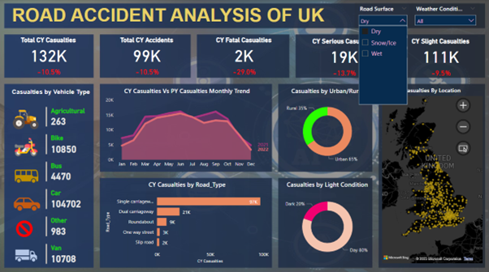

### When the road is wet
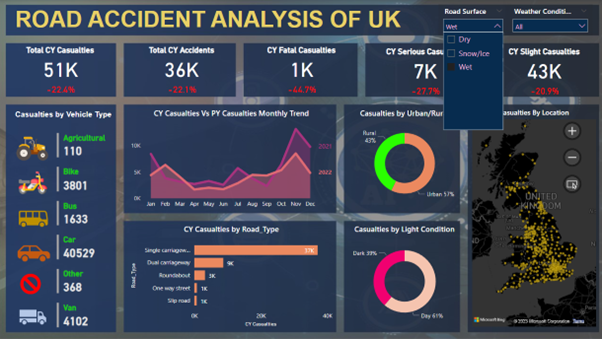

### When the weather is rainy
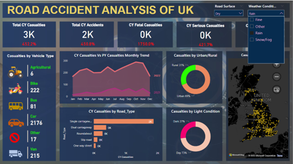

### When the weather is fine
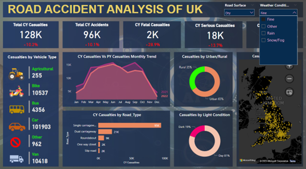

### Slicers
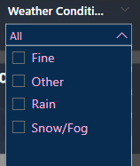

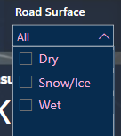

## Data Source

You can find the dataset in the gituhub repository only to work upon. It includes information such as Accident_Index, Accident Date, Day_of_Week, Junction_Control, Junction_Detail, Accident_Severity, Latitude, Light_Conditions, Local_Authority_(District), Carriageway_Hazards, Longitude, Number_of_Casualties, Number_of_Vehicles, Police_Force, Road_Surface_Conditions, Road_Type, Speed_limit, Time, Urban_or_Rural_Area, Weather_Conditions, and Vehicle_Type. The dataset has been preprocessed and transformed to ensure its suitability for analysis in Power BI.

## Installation

To run this project locally, follow these steps:

1. Clone the repository using the following command:

git clone https://github.com/Apurv-Here/Accident_Analysis_Power_BI.git

2. Ensure you have Power BI Desktop installed on your machine. If not, download and install it from the official [Power BI website](https://powerbi.microsoft.com/en-us/desktop/).

3. Open Power BI Desktop and navigate to "File" > "Open" > "File" to select the project file located in the cloned repository.

4. Once the project is loaded, you can explore the different dashboards and reports.

## Usage

To use this project, follow these steps:

1. Open the Power BI project file using Power BI Desktop.

2. Navigate through the various tabs and visuals to explore the road accident data.

3. Interact with the filters and slicers to customize the views according to your requirements.

4. Gain insights from the visualizations and analyze the road accident trends and contributing factors.

## Structure

The project is structured into the following sections:

1. Data Cleaning
2. Data Modelling
3. Data Visualization

## Data Cleaning

In the data cleaning phase, we performed the following steps:

- Imported the provided CSV data into Power BI and created a table named "Data".
- Renamed the table as "Data" to better reflect its content.
- Removed the spelling mistakes and replaced it with the correct ones to avoid loss of data
- Formatted the date and time column correctly
- Made a calendar table as well 

## Data Modelling

For data modelling, we created the following additional table:

- **Calendar**: This table contains columns for Date, Year, Month, and Month Number.

We established a one-to-many relationship between the "Calendar" table and the "Data" table based on the date.

We created many new measures in the data table itself to solve our problem. 

We used the power bi DAX feature as well such as:

Before starting to solve the problems we can see we need these 4 main measures to build our visualization.
PY Accidents
PY Casualties
YoY Accidents
YoY Casualties

DAX for these are:

PY Accidents = CALCULATE(COUNT(Data[Accident_Index]), SAMEPERIODLASTYEAR('Calendar'[Date]))

PY Casualties = CALCULATE(SUM(Data[Number_of_Casualties]), SAMEPERIODLASTYEAR('Calendar'[Date]))

YoY Accidents = ([CY Accidents Count] - [PY Accidents]) / [PY Accidents]

YoY Casualties = ([CY Casualties] - [PY Casualties]) / [PY Casualties]

## Data Visualization

Now let's explore the visualizations for the seven problem statements:

### 1. Primary KPI – Total Casualties and Total Accidents values for Current Year and YoY growth.

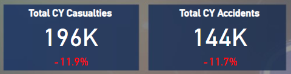

This card provides an overview of the total casualties and total accidents for the current year, along with their year-over-year (YoY) growth. It helps to identify trends with compare to previous year in percent and understand the impact of road accidents.

### 2. Primary KPI – Total Casualties by Accident Severity for Current Year and YoY growth.

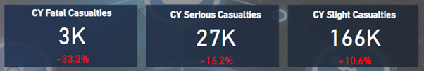

This card illustrates the distribution of total casualties by accident severity for the current year. It also shows the YoY growth, providing insights into changes compared to the previous year.

### 3. Secondary KPI’s – Total Casualties with respect to vehicle type for Current Year.

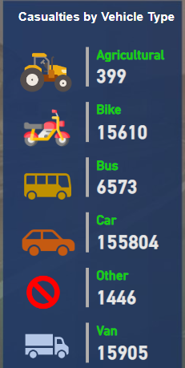

This table displays the total casualties categorized by vehicle type for the current year. It helps to identify which vehicle types are involved in the most accidents.

### 4. Monthly trend showing comparison of casualties for Current Year and Previous Year.

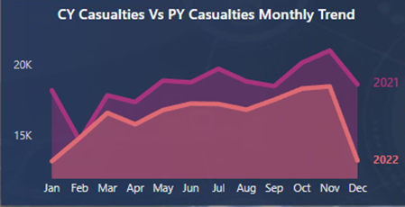

This line chart compares the monthly casualties for the current year and the previous year. It allows us to analyze the variations in casualties over time.

### 5. Casualties by Road Type for Current Year.

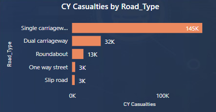

This bar chart presents the distribution of casualties by road type for the current year. It provides insights into which types of roads are associated with higher accident rates.

### 6. Current Year Casualties by Area/Location & by Day/Night.

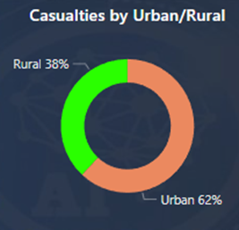

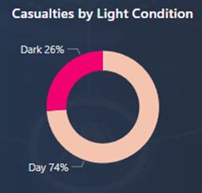

These donut column chart showcases the current year's casualties categorized by area/location and further differentiated by day and night. It helps in understanding the patterns of accidents based on different areas and time periods.

### 7. Total Casualties and Total Accidents by Location.

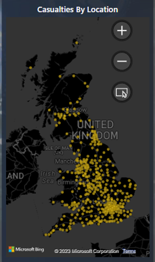

This map visualization displays the total casualties and total accidents by location in the UK. It provides a visual representation of the distribution of accidents and casualties across different geographic areas.

## Conclusion
The "Road Accident Analysis in UK" Power BI project provides valuable insights into road accidents in the UK. Through data cleaning, modeling, and visualization, we have addressed the seven problem statements related to casualties, accidents, accident severity, vehicle types, monthly trends, road types, and location-based analysis.

The visualizations help in understanding the current year's data, year-over-year growth, and comparisons between different variables. These insights can be utilized to make informed decisions and take necessary measures to improve road safety.

Feel free to explore the code and screenshots provided in this repository to gain a better understanding of the analysis conducted in the "Road Accident Analysis in UK" Power BI project.

## Contributing

Contributions to this project are welcome. If you have any ideas, suggestions, or improvements, please open an issue or submit a pull request.

