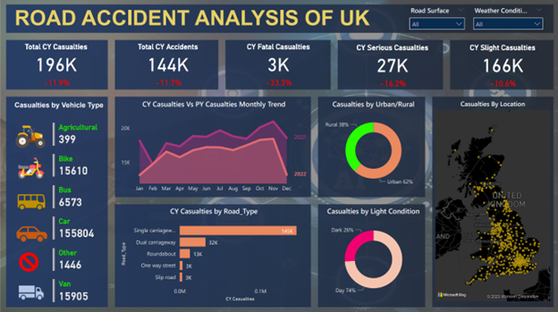

# Road Accident Analysis in UK

This repository contains a Power BI project that focuses on analyzing road accidents in the UK. The project aims to provide valuable insights and visualizations to understand various aspects related to road accidents. The dataset used for this analysis includes information such as accident date, accident severity, vehicle type, road type, casualties, and other relevant attributes.

## Screenshots

### Main Dashboard

### Interactive and changing dashboard with filters 

### When the road is dry

### When the road is wet

### When the weather is rainy

### When the weather is fine

### Slicers

## Structure

The project is structured into the following sections:

1. Data Cleaning
2. Data Modelling
3. Data Visualization

## Data Cleaning

In the data cleaning phase, we performed the following steps:

- Imported the provided CSV data into Power BI and created a table named "Data".
- Renamed the table as "Data" to better reflect its content.

## Data Modelling

For data modelling, we created the following additional table:

- **Calendar**: This table contains columns for Date, Year, Month, and Month Number.

We established a one-to-many relationship between the "Calendar" table and the "Data" table based on the date.

## Data Visualization

Now let's explore the visualizations for the seven problem statements:

### 1. Primary KPI – Total Casualties and Total Accidents values for Current Year and YoY growth.

This line chart provides an overview of the total casualties and total accidents for the current year, along with their year-over-year (YoY) growth. It helps to identify trends and understand the impact of road accidents.

### 2. Primary KPI – Total Casualties by Accident Severity for Current Year and YoY growth.

This stacked column chart illustrates the distribution of total casualties by accident severity for the current year. It also shows the YoY growth, providing insights into changes compared to the previous year.

### 3. Secondary KPI’s – Total Casualties with respect to vehicle type for Current Year.

This bar chart displays the total casualties categorized by vehicle type for the current year. It helps to identify which vehicle types are involved in the most accidents.

### 4. Monthly trend showing comparison of casualties for Current Year and Previous Year.

This line chart compares the monthly casualties for the current year and the previous year. It allows us to analyze the variations in casualties over time.

### 5. Casualties by Road Type for Current Year.

This donut chart presents the distribution of casualties by road type for the current year. It provides insights into which types of roads are associated with higher accident rates.

### 6. Current Year Casualties by Area/Location & by Day/Night.

This stacked column chart showcases the current year's casualties categorized by area/location and further differentiated by day and night. It helps in understanding the patterns of accidents based on different areas and time periods.

### 7. Total Casualties and Total Accidents by Location.

This map visualization displays the total casualties and total accidents by location in the UK. It provides a visual representation of the distribution of accidents and casualties across different geographic areas.

## Conclusion
The "Road Accident Analysis in UK" Power BI project provides valuable insights into road accidents in the UK. Through data cleaning, modeling, and visualization, we have addressed the seven problem statements related to casualties, accidents, accident severity, vehicle types, monthly trends, road types, and location-based analysis.

The visualizations help in understanding the current year's data, year-over-year growth, and comparisons between different variables. These insights can be utilized to make informed decisions and take necessary measures to improve road safety.

Feel free to explore the code and screenshots provided in this repository to gain a better understanding of the analysis conducted in the "Road Accident Analysis in UK" Power BI project.

# UK Road Analysis Power BI Project

This is the README file for the UK Road Analysis Power BI project, which aims to analyze and visualize road accident data in the UK using Power BI. This project utilizes Power BI to create interactive dashboards and reports that provide insights into road accident trends, contributing factors, and potential preventive measures.

## Table of Contents
- [Project Overview](#project-overview)
- [Data Source](#data-source)
- [Installation](#installation)
- [Usage](#usage)
- [Problem Statements](#problem-statements)
- [Solution](#solution)
- [Contributing](#contributing)

## Project Overview

The UK Road Analysis Power BI project is designed to provide a comprehensive analysis of road accident data in the UK. By leveraging the capabilities of Power BI, this project offers visually appealing and interactive dashboards that facilitate the exploration and understanding of road accident patterns, causes, and impacts.

## Data Source

You can find the dataset in the gituhub repository only to work upon. It includes information such as Accident_Index, Accident Date, Day_of_Week, Junction_Control, Junction_Detail, Accident_Severity, Latitude, Light_Conditions, Local_Authority_(District), Carriageway_Hazards, Longitude, Number_of_Casualties, Number_of_Vehicles, Police_Force, Road_Surface_Conditions, Road_Type, Speed_limit, Time, Urban_or_Rural_Area, Weather_Conditions, and Vehicle_Type. The dataset has been preprocessed and transformed to ensure its suitability for analysis in Power BI.

## Installation

To run this project locally, follow these steps:

1. Clone the repository using the following command:

git clone https://github.com/Apurv-Here/Accident_Analysis_Power_BI.git

2. Ensure you have Power BI Desktop installed on your machine. If not, download and install it from the official [Power BI website](https://powerbi.microsoft.com/en-us/desktop/).

3. Open Power BI Desktop and navigate to "File" > "Open" > "File" to select the project file located in the cloned repository.

4. Once the project is loaded, you can explore the different dashboards and reports.

## Usage

To use this project, follow these steps:

1. Open the Power BI project file using Power BI Desktop.

2. Navigate through the various tabs and visuals to explore the road accident data.

3. Interact with the filters and slicers to customize the views according to your requirements.

4. Gain insights from the visualizations and analyze the road accident trends and contributing factors.

## Problem Statements

This project addresses several problem statements related to UK road analysis:

1. Problem Statement 1: Identify the most common causes of road accidents in the UK.
2. Problem Statement 2: Analyze the impact of weather conditions on road accidents.
3. Problem Statement 3: Explore the relationship between road surface conditions and accident severity.
4. Problem Statement 4: Investigate the influence of speed limits on the number of casualties.
5. Problem Statement 5: Identify the types of vehicles involved in the majority of accidents.

## Solution

The UK Road Analysis Power BI project offers solutions to the aforementioned problem statements:

1. Solution to Problem Statement 1: Utilize interactive charts and tables to identify the top causes of road accidents in the UK. Visualize the data using bar charts or pie charts to highlight the most frequent causes, such as reckless driving, speeding, or distracted driving.

2. Solution to Problem Statement 2: Use visualizations like line charts or heat maps to analyze the relationship between weather conditions and road accidents. Identify patterns, such as increased accidents during rainy or foggy weather, and provide recommendations for safer driving practices during adverse weather conditions.

3. Solution to Problem Statement 3: Analyze accident severity based on different road surface conditions using interactive visuals such as stacked column charts or scatter plots. Determine if certain road surface conditions, such as wet or icy roads, contribute to more severe accidents. Provide insights on the importance of maintaining proper road conditions for reducing accidents.

4. Solution to Problem Statement 4: Examine the relationship between speed limits and the number of casualties involved in road accidents. Create visuals like line charts or bar charts to showcase the correlation between speed limits and casualty rates. Highlight the significance of adhering to speed limits to minimize the severity of accidents.

5. Solution to Problem Statement 5: Explore the involvement of different vehicle types in road accidents through interactive visuals such as donut charts or tree maps. Identify the most commonly involved vehicle types, such as cars, motorcycles, or trucks, and analyze their impact on accident outcomes. Provide recommendations for specific vehicle safety measures based on the findings.

## Contributing

Contributions to this project are welcome. If you have any ideas, suggestions, or improvements, please open an issue or submit a pull request.

